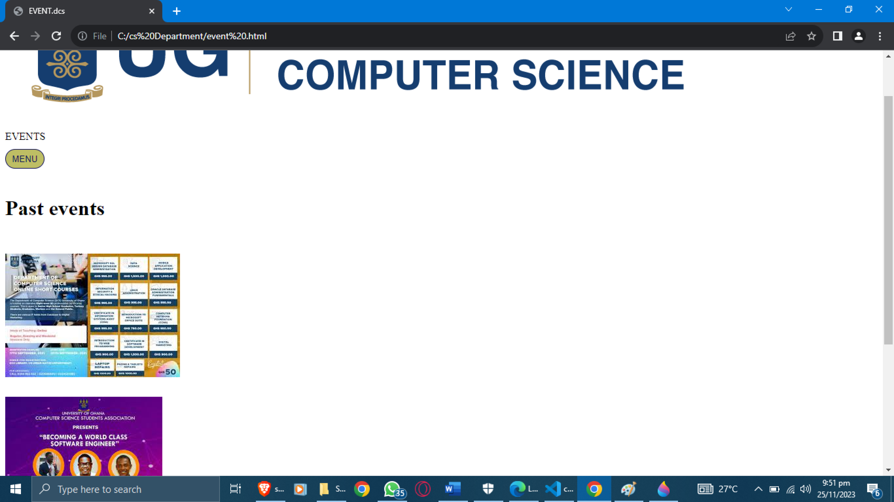
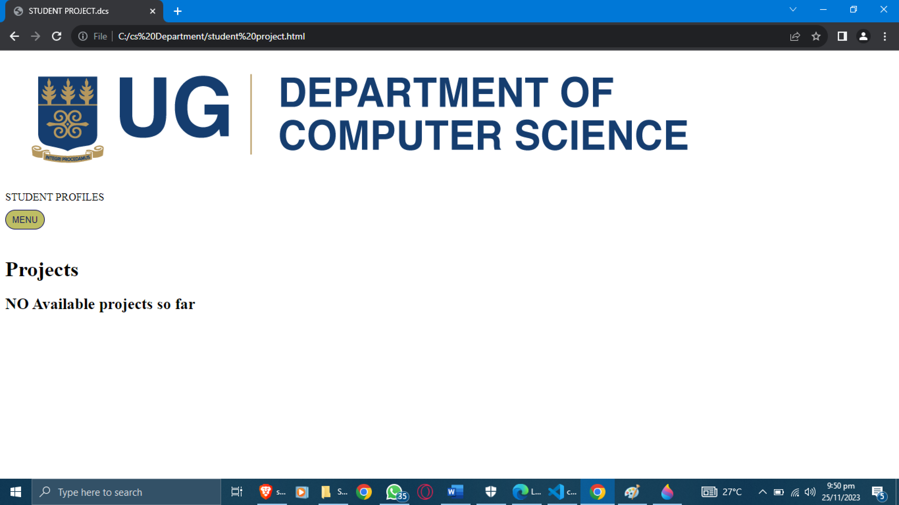
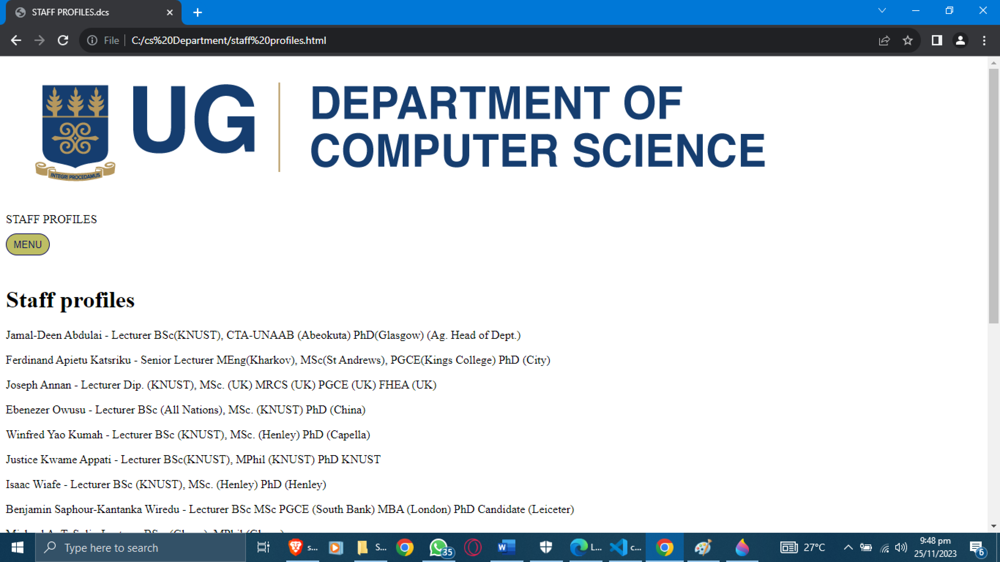
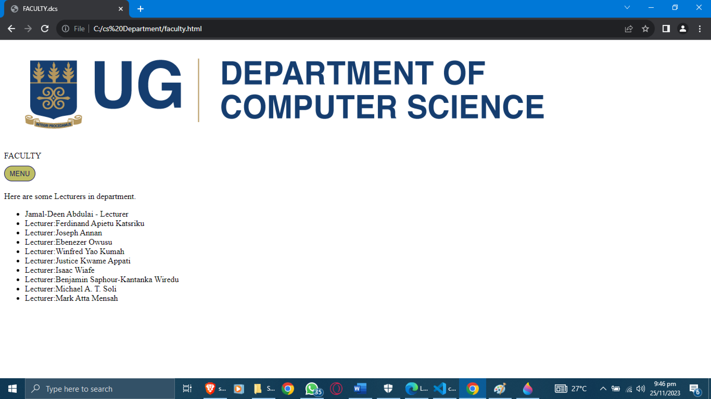
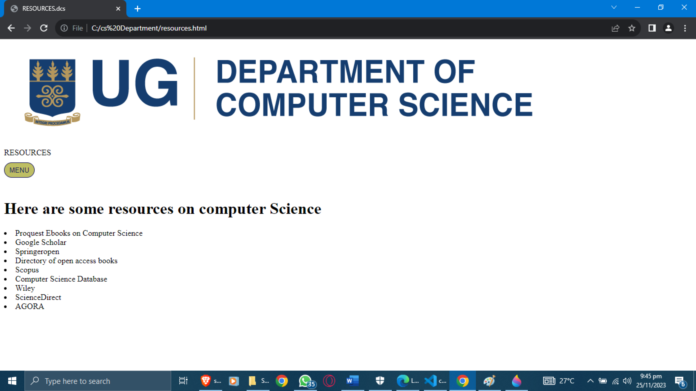
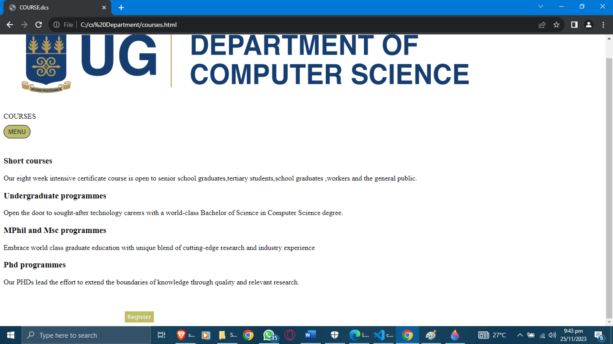
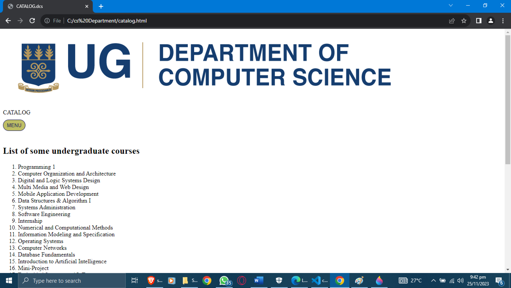
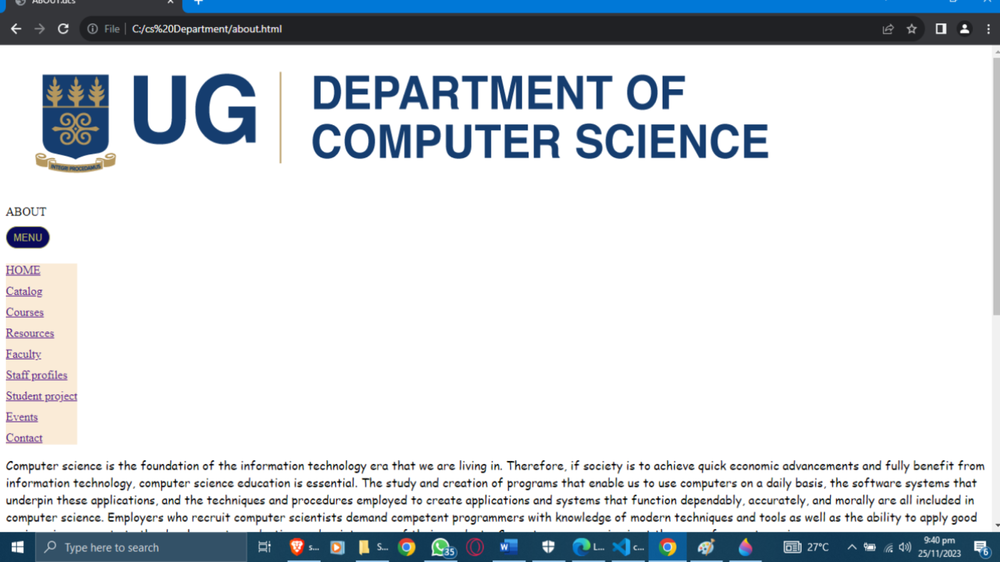

# DCIT_205_IA
This website is not cloned one but is similar in it work to the Computer Science Department of University of Ghana. This website is used to educate the viewer about the department. In cloning the project you can just visit my GitHub account ,and clone repository on this project. For the project to work you must make sure you retrieve all the files to the project on my GitHub account.
My name is Kelvin Martey Mamah, with ID number:11237476.

## These are the screen shots of the project.
          
